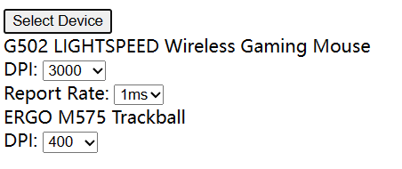

# G-Web

A Logitech™ device manager in browsers. It uses WebHID API to interact with devices connected via USB (corded or through receivers) or Bluetooth.

G-Web is not a official product of Logitech.

Current state:

## Limitations

1. Due to security concerns, it can't detect and connect to devices automatically. Users must select their devices from a browser-provided popup to permit the connection.
2. Because it runs in browser, it won't support certain custom key mapping features (divert mode) like macro or launching programs.

## Roadmap

### General

- [x] Device name
- [x] Device type
- [x] Battery level
  - [x] 0x1000
  - [x] 0x1001
  - [x] 0x1004
  - [x] 0x1f20

### Receiver

- [x] List connected devices
- [ ] List paired devices
- [ ] Pair new devices

### Mouse

- [x] Report rate
- [x] DPI
- [ ] On board profile
  - [x] Basic reading
  - [ ] Basic writing
  - [ ] Button mapping
  - [ ] RGB
- [ ] Button mapping
- [ ] Gesture
- [ ] **R!G!B!**

### Keyboard

> I don't have a Logitech keyboard so no feature planned.

## References

* http://drive.google.com/folderview?id=0BxbRzx7vEV7eWmgwazJ3NUFfQ28
* [pwr-Solaar/Solaar](https://github.com/pwr-Solaar/Solaar)
* [cvuchener/hidpp](https://github.com/cvuchener/hidpp)
* [libratbag/libratbag](https://github.com/libratbag/libratbag)
* [jte/logitech-rce](https://github.com/jte/logitech-rce)
* [PixlOne/logiops](https://github.com/PixlOne/logiops)
